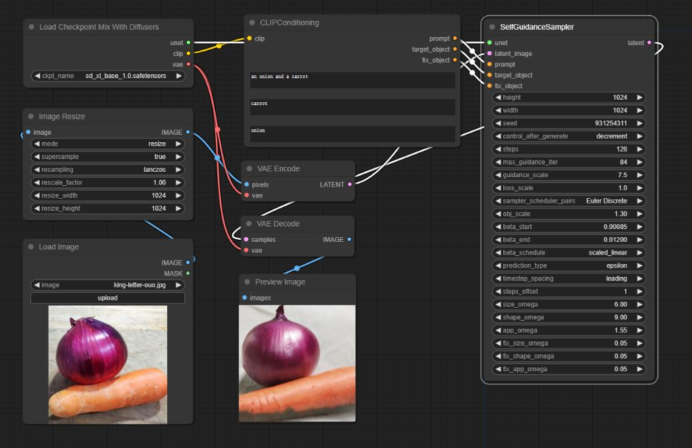
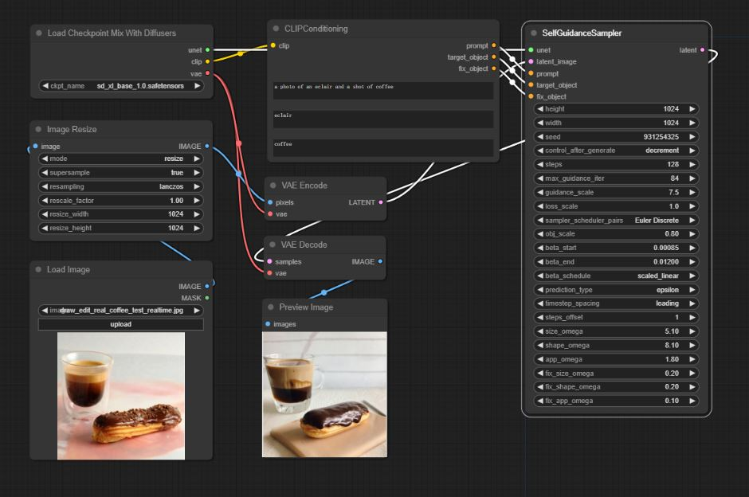
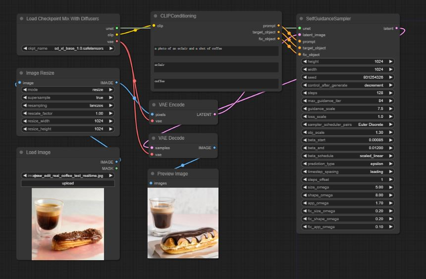

# comfyui-self-guidance
Unofficial ComfyUI implementation of [Diffusion Self-Guidance for Controllable Image Generation](https://dave.ml/selfguidance/)

## Installation
Clone this repo into custom_nodes folder or use Manager.

## Workflow 
### the spatial manipulation of objects in real images
- **[example workflow](./examples/workflows/example.json)**

#### Example 1
use *[example1.jpg](./examples/images/example1.jpg)*
- ```an onion and a carrot```
- set ```carrot``` as target object, set ```onion``` as fix object
- shrink, scale factor = 0.8

- enlarge, scale factor = 1.3

#### Example 2
use *[example2.jpg](./examples/images/example2.jpg)*
- ```a photo of an eclair and a shot of coffee```
- set ```eclair``` as target object, set ```coffee``` as fix object
- shrink, scale factor = 0.8

- enlarge, scale factor = 1.3


## Note
Currently only SD series models are supported. 
